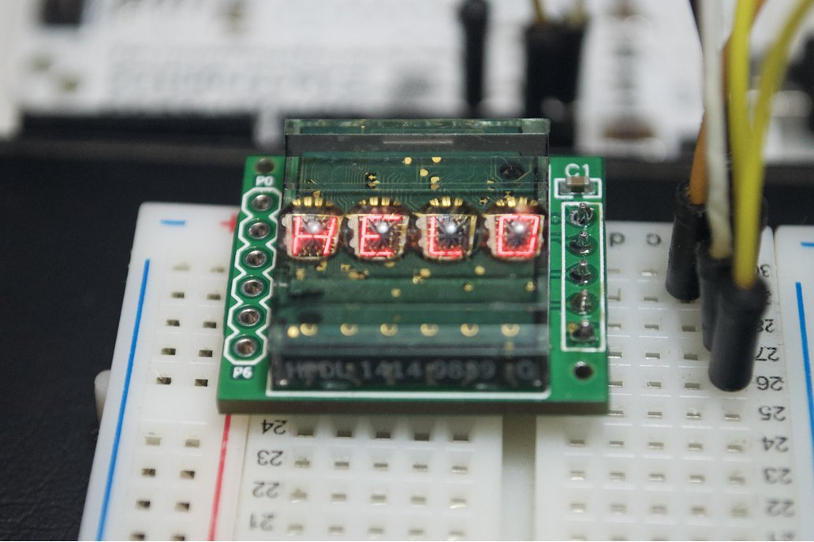

AW9523B LED Driver & GPIO I2C 16bit expander library
========================================================

Arduino library for the I2C I/O expander chip AW9523B
from Shanghai awinic technology co.,ltd. Based on its [technical doc](https://www.alldatasheet.com/datasheet-pdf/pdf/1148542/AWINIC/AW9523B.html) reference.

Breakout board
---------------
I've made a breakout board with this chip for Arduino/Raspberry with support for retro HPDL-1414 and it's available for purchasing at Tindie.com 👉 [Retro display LED Driver & 16bit I2C I/O expander](https://www.tindie.com/products/mrmx/retro-display-led-driver-16bit-i2c-io-expander/) and here it's the 🛠 [Schematic](hw/Schematic_AW9523B_DL1414-I2C.png).

#### Features
- [AW9523B](https://www.alldatasheet.com/datasheet-pdf/pdf/1148542/AWINIC/AW9523B.html) chip
- 2.5V~5.5V power supply
- ESD protection: ±4000V
- 16 GPIO's (6 free if display is used, P0-P5)
- Any GPIO can be configured as an input or an output independently
- LED PWM driver mode with 256 levels/LED and 4 global dim levels
- A fancy retro display: [HPDL-1414](https://pdf1.alldatasheet.com/datasheet-pdf/view/64705/HP/HPDL1414.html)
- Dimensions: 25 x 22 [mm]

Other libs
---------------
This chip is cool enough that Adafruit has made [another board](https://learn.adafruit.com/adafruit-aw9523-gpio-expander-and-led-driver) and [oss lib](https://github.com/adafruit/Adafruit_AW9523).

Contact
---------------
Twitter: [@mrmx](https//twitter.com/mrmx)

License
---------------

This code is released under the MIT License. Please see [LICENSE](LICENSE) for the full text.
